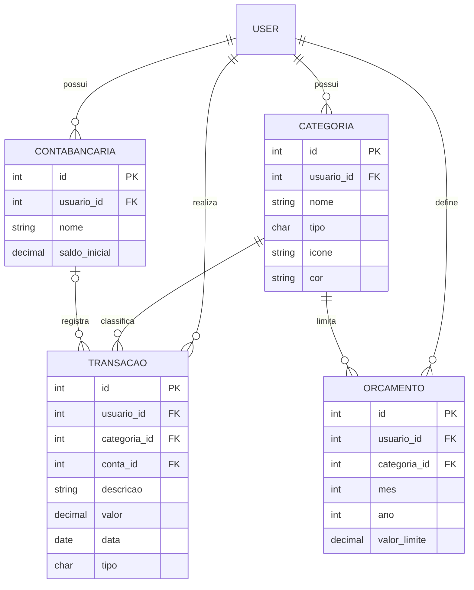

# FinTrack — Gestor de Finanças Pessoais

Aplicação web para registro de receitas e despesas, organização por categorias e definição de orçamentos mensais. Projeto desenvolvido para a disciplina **GAC116 - Programação Web** (UFLA, 2026/1).

## Tecnologias (Stack)

- **Backend:** Python 3.12, Django 6.x
- **Banco de Dados:** PostgreSQL 15
- **Infraestrutura:** Docker e Docker Compose
- **Frontend:** HTML, CSS (Bootstrap) e Chart.js

## Como rodar o projeto localmente

### Com Docker (recomendado)

```bash
git clone https://github.com/MiguelChagas/Trabalho-ProgWeb.git
cd Trabalho-ProgWeb
docker compose up --build -d
```

Aplique as migrations (primeira vez):

```bash
docker compose exec web python manage.py migrate
```

Acesse em: http://localhost:8000

Para criar o superusuário (primeira vez):

```bash
docker compose exec web python manage.py createsuperuser
```

Para carregar dados de teste:

```bash
docker compose exec web python manage.py loaddata categorias_iniciais
```

### Sem Docker

```bash
pip install -r requirements.txt
python manage.py migrate
python manage.py createsuperuser
python manage.py runserver
```

## Credenciais de teste

| Usuário | Senha | Perfil |
|---------|-------|--------|
| `admin` | (definido no createsuperuser) | Superusuário (acesso ao /admin) |
| `usuario_teste` | `teste123` | Usuário comum |

> As fixtures criam o `usuario_teste` com dados de exemplo (categorias, transações e orçamentos de maio/2026).

## Modelo de Dados

### Diagrama ER



### Descrição dos models

#### Categoria
Agrupa transações por natureza (ex: Alimentação, Salário). Pertence a um usuário específico.

| Campo | Tipo | Descrição |
|-------|------|-----------|
| `nome` | CharField(100) | Nome da categoria |
| `tipo` | CharField(1) | R = Receita, D = Despesa |
| `icone` | CharField(50) | Nome do ícone (opcional) |
| `cor` | CharField(7) | Cor em hex, ex: #FF6B6B |

#### ContaBancaria
Conta corrente, poupança ou carteira do usuário.

| Campo | Tipo | Descrição |
|-------|------|-----------|
| `nome` | CharField(100) | Nome da conta |
| `saldo_inicial` | DecimalField | Saldo no momento do cadastro |

#### Transacao
Registro de cada receita ou despesa.

| Campo | Tipo | Descrição |
|-------|------|-----------|
| `descricao` | CharField(255) | Descrição livre |
| `valor` | DecimalField | Valor > 0 |
| `data` | DateField | Data da transação |
| `tipo` | CharField(1) | R = Receita, D = Despesa |
| `categoria` | FK Categoria | RESTRICT: impede exclusão de categoria com transações |
| `conta` | FK ContaBancaria | Opcional; SET_NULL: transação permanece se conta for excluída |

#### Orcamento
Define um teto de gastos por categoria em determinado mês.

| Campo | Tipo | Descrição |
|-------|------|-----------|
| `mes` | IntegerField | 1 a 12 |
| `ano` | IntegerField | Ex: 2026 |
| `valor_limite` | DecimalField | Valor máximo permitido para a categoria no mês |
| `categoria` | FK Categoria | Categoria limitada |

**Restrição:** unique_together(usuario, categoria, mes, ano) — impede orçamentos duplicados.

## Regras de Negócio

- **Integridade referencial (on_delete):**
  - Transacao → Categoria: usa RESTRICT — impede deletar categoria com transações vinculadas
  - Transacao → ContaBancaria: usa SET_NULL — transação permanece sem vínculo se conta for excluída
- **Unicidade (unique_together):** impede dois orçamentos para mesma categoria no mesmo mês/ano
- **Validações:**
  - Transacao.valor e Orcamento.valor_limite devem ser maiores que zero
  - Orcamento.mes deve estar entre 1 e 12
  - O tipo da transação deve corresponder ao tipo da categoria

## Pontos Extras Implementados

- [x] Docker e Docker Compose
- [x] PostgreSQL como banco de dados
- [ ] Deploy em produção

## Equipe

| Nome | GitHub |
|------|--------|
| Miguel Chagas | @MiguelChagas |
| Henrique Cesar | @henriqueecss |
| Bernardo Pavani | @Bernardopavani |
